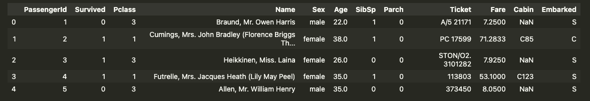
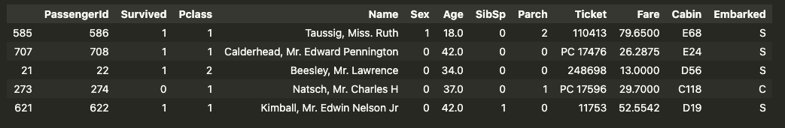
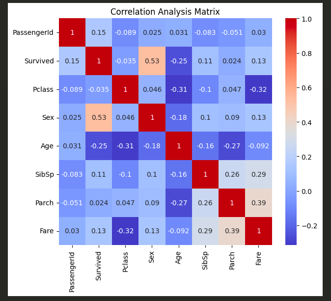
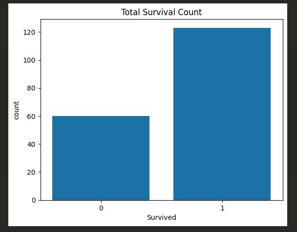
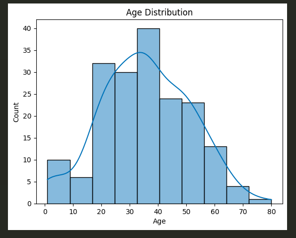
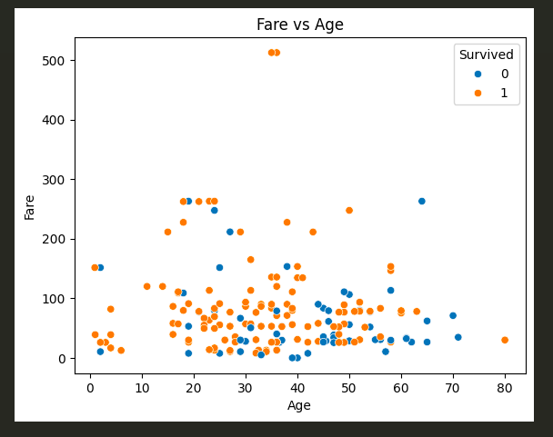

## Introduction

In this world of Computer and AI, every single click, message, or post becomes **data**. We can clearly say that we live in the age of data. But why is this data so much important. This data after going through some processes will become so much useful and powerful that it can make your life. What are these processes, how can we use them and ... It's so confusing.
Let's dive into the world of data to come out of this confusion and understand how we can make this data so useful that it makes our life.

## What is Data Analysis

The data we receive in every click, message, or post is raw data. It means it can't be used as it is now. We have to work on it, understand it, and make it useful. This whole process of making raw data into something useful is what we call **Data Analysis**.

> Data Analysis is the systematic process of collecting, cleaning, transforming, and modelling data to discover useful information, identify patterns and support decision-making

Data analysis is a **game of hide and seek** where you have to search everything like **trends, patterns, answer of your questions, or anything data is hiding**. To be the winner of this game you have to do nothing **just uncover the truth behind the data**.

## Why Python for Data Analysis

Data analysis is so simple that you can do it on paper but the time it will take and the frustration it will give might make you stop before you start it. So what tools we can use for data analysis. The most commonly used softwarers for data analysis is **Excel, SQL,** or **Python**. Let's compare them and find out why **Python** is on the top out of three.

| Feature                           | Excel                                      | SQL                                                        | Python                                                              |
| --------------------------------- | ------------------------------------------ | ---------------------------------------------------------- | ------------------------------------------------------------------- |
| **Best For**                      | Quick analysis, small datasets, reporting  | Querying and managing structured databases                 | Advanced analysis, automation, machine learning                     |
| **Learning Curve**                | Easy (beginner-friendly UI)                | Moderate (requires query syntax knowledge)                 | Moderate to advanced (programming required)                         |
| **Data Size Handling**            | Limited (~1M rows, slows with large files) | Handles very large datasets efficiently                    | Handles large datasets (depends on memory & tools like Pandas/Dask) |
| **Data Storage**                  | Spreadsheet files (.xlsx)                  | Relational databases (MySQL, PostgreSQL, SQL Server, etc.) | Files, databases, APIs, big data systems                            |
| **Data Cleaning**                 | Manual, formulas, Power Query              | Basic cleaning with queries                                | Powerful libraries (Pandas, NumPy)                                  |
| **Visualization**                 | Built-in charts & pivot charts             | Limited (depends on BI tools)                              | Advanced (Matplotlib, Seaborn, Plotly)                              |
| **Automation**                    | Macros (VBA)                               | Stored procedures                                          | Full automation scripts & pipelines                                 |
| **Reproducibility**               | Moderate (manual steps harder to track)    | High (saved queries)                                       | Very high (scripts & notebooks)                                     |
| **Statistical & ML Capabilities** | Basic                                      | Very limited                                               | Extensive (scikit-learn, TensorFlow, etc.)                          |

## Types of Data Analysis

Data serves many purpose and for that we have different types of analysis. Different type of data analysis are as follows:

1. `Descriptive Analysis`: Descriptive analysis is the process of organizing, summarising, and presenting historical data to understand what has already happened. Its goal is to describe patterns, trends, and key metrics from past data.
   **Example** - Summarising monthly sales, calculating average marks, or creating dashboards that show performance indicators.

2. `Diagnostic Analysis`: This analysis is the process of examining data in depth to determine the causes or reason behind past outcomes. The goal of this analysis is to answer why something happened. \*\*Example -\*\* Investing why profit declined by analysing market spend, customer behaviour, and operational costs.

3. `Predictive Analysis`: Predictive analysis uses statistical techniques, historical data, and machine learning models to estimate the likelihood of future events or trends. Its goal is to predict what is likely to happen in future. \*\*Example -\*\* Forecasting next quarter's sales or predicting customer churn.

4. `Prescriptive Analysis`: Prescriptive analysis uses advanced analytical methods, including optimization and simulation, to recommend specific actions that will achieve desired outcomes. Its goal is to determine what action should be taken. \*\*Example -\*\* Amazon recommending products to customers or optimising delivery routes to reduce costs.

## Data Analysis Process

Data Analysis is the combination of six steps or we can say that data analysis process can be broken down into six sub-process to approach any data related problems systematically and ensuring accurate and reliable results.

1. `Define The Problem`: Before starting analysis, it's important to understand the **problem in hand**. We can understand it by defining the question, setting our goals or problems and aligning it with client or stakeholder's expectations. **Example -** _Predict which customers are likely to churn, Finding patterns of customers for Ad campaign._
   </br>

2. `Collect Data`: After defining the problem, the next step is collecting data relevant for your problem and from relevant sources. You can get data from internal databases, APIs, surveys or web scraping. Besides that you can get data from publicly available datasets like Kaggle. Collecting right data ensure the accuracy of your analysis.

```python
import pandas as pd

# Load data from csv
data = pd.read_csv('titanic.csv')
data.head()
```



3. `Data Cleaning`: Now our raw data is ready for analysis. In this process we work on missing values, duplicates, wrong values, standardizing formats and converting categorical values into numerical forms as per our need.

```python
# Handle Missing Values
data = data.dropna()  # removes rows with blank values

# Convert categorical data to numbers
data['Sex'] = data['Gender'].map({'male' : 0, 'female' : 1})

data.smaple(5)
```



4. `Data Analysing`: Data Analysing is the step where we find out the patterns, trends, and relationships. Based on the problem we have this step include descriptive statistics, correlation analysis or somethiing more.

```python
import matplotlib.pyplpot as plt
import seaborn as sns

plt.figure(figsize=(10,8))
sns.heatmap(data.corr(), annot = True, cmap = 'coolwarm')
plt.title('Correlation Analysis Matrix')
plt.show()
```



_<u>Note:</u> This data only contaiins columns which has numeric values so either drop those columns which have string values or change them into numberic values before running the above mentioned plot._

5. `Data Visualization`: Data Visualization is the process where we present our complex data in form of charts or plots. This process help us to understand data easily. We can highlight key insights, patterns and outliers.

```python
sns.countplot(x = data['Survived'])
plt.title('Total Survival Count')
plt.show()
```



```python
sns.histplot(data['Age'], kde = True)
plt.title('Age Distribution')
plt.show()
```



```python
sns.scatterplot(x = data['Age'], y = data['Fare'], hue = data['Survived'])
plt.title('Fare vs Age')
plt.show()
```



6. `Data Interpretation`: The final step is presenting the key findings, and actionable insights. Interpretation involves communicating the findings effectively and making data driven decisions.

These are the steps or processes involved in Data Analysis.

## Conclusion

Data is the backbone of everything and Data Analysis is the only way you can use the data effectively. It is not important, in which sector you are using data analysis as it is useful and effective in every sector whether it is Politics, Education, Healthcare, or any other sector. Data analysis empowers us to move from guesswork to informed action. And in today's data-driven world, that shift makes all the difference.
